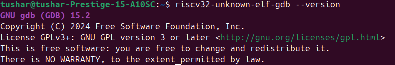

# Task-1: Install & Sanity-Check the RISC-V Toolchain

## Step 1: Download the Toolchain

Download the RISC-V toolchain from the following link:  
[riscv-toolchain-rv32imac-x86_64-ubuntu.tar.gz](https://vsd-labs.sgp1.cdn.digitaloceanspaces.com/vsd-labs/riscv-toolchain-rv32imac-x86_64-ubuntu.tar.gz)

---

## Step 2: Extract the Toolchain

Open a terminal and run:
```bash
cd ~/Downloads
tar -xzf riscv-toolchain-rv32imac-x86_64-ubuntu.tar.gz
```

---

## Step 3: Add Toolchain to PATH

Edit your `~/.bashrc` file and add the toolchain to your PATH:
```bash
vim ~/.bashrc
# Add the following line at the end of the file:
export PATH=$PATH:~/Downloads/riscv-toolchain-rv32imac-x86_64-ubuntu/bin
```
After editing, reload your `.bashrc`:
```bash
source ~/.bashrc
```

---

## Step 4: Verify the Installation

Check if the toolchain is installed correctly:

```bash
riscv32-unknown-elf-gcc --version
```
**Expected Output:**  


```bash
riscv32-unknown-elf-objdump --version
```
**Expected Output:**  


```bash
riscv32-unknown-elf-gdb --version
```
**Expected Output:**  


---

## Problem/Issue Faced

```bash
riscv32-unknown-elf-gdb: error while loading shared libraries: libpython3.10.so.1.0: cannot open shared object file: No such file or directory
```
This means the GDB binary is dynamically linked against Python 3.10, but the required library is missing.

---

## Fix

Install the required Python version and development files:
```bash
sudo apt update
sudo apt install python3.10 python3.10-dev
```
