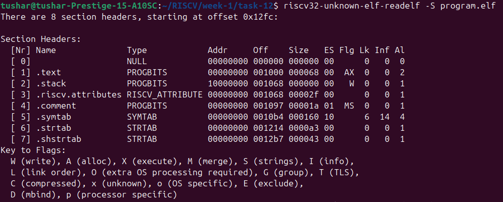
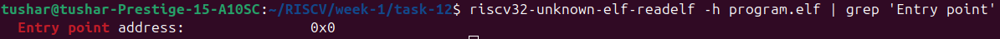

# Task-12: Start-up Code & crt0

In this section, we'll see what is crt0 file, what role does it play in bare-metal risc-v programs and how can we get one.

---

## What is crt0 and why do we need it?

`crt0` stands for **C runtime 0**. In a typical bare-metal RISC-V program, there is no operating system to initialize the system before our main code runs.

So, we use a startup assembly file (`crt0.s`) that sets up the basic runtime environment for our code. It is the **first code that runs after reset**.

### What does crt0 do?

| Step | What Happens in crt0.S                | Why It Matters                                 |
|------|---------------------------------------|------------------------------------------------|
| 1    | Define `_start` (the entry point)     | The CPU starts here after reset                |
| 2    | Initialize stack pointer              | So the C code (like `main`) can use the stack  |
| 3    | Zero the `.bss` section               | C standard requires uninitialized globals to be 0 |
| 4    | Copy `.data` from Flash to RAM        | So initialized globals work correctly          |
| 5    | Call `main()`                         | This is your actual application logic          |
| 6    | Optionally call exit or hang          | To handle the end of execution cleanly         |

---

## Where can we get one?

- We can write our own based on the example below
- Or we can use one from:
  - Newlib
  - riscv-pk (proxy kernel)
  - Minimal RISC-V templates by SiFive
  - Embedded frameworks like RIOT OS, Zephyr RTOS, etc.

---

## main C program
```c
    int main() {
        while(1) {

        }
        return 0;
    }
```

## Writing `crt0.s`

```assembly
.section .text
.globl _start

_start:
    # Set up stack pointer (end of SRAM)
    la sp, _stack_top

    # Clear .bss section
    la a0, __bss_start
    la a1, __bss_end
    li a2, 0
bss_clear:
    bge a0, a1, bss_done
    sw a2, 0(a0)
    addi a0, a0, 4
    j bss_clear
bss_done:

    # Copy .data section from Flash to RAM
    la a0, _data_lma      # load memory address (Flash)
    la a1, _data_start    # virtual memory address (RAM)
    la a2, _data_end
copy_data:
    bge a1, a2, data_done
    lw t0, 0(a0)
    sw t0, 0(a1)
    addi a0, a0, 4
    addi a1, a1, 4
    j copy_data
data_done:

    # Call main
    call main

hang:
    j hang  # Loop forever
```

---

## Example Linker Script

```ld
ENTRY(_start)

MEMORY
{
    FLASH (rx)  : ORIGIN = 0x00000000, LENGTH = 512K
    SRAM  (rwx) : ORIGIN = 0x10000000, LENGTH = 64K
}

SECTIONS
{
    .text : {
        *(.text*)
        *(.rodata*)
    } > FLASH

    .data : AT (ADDR(.text) + SIZEOF(.text)) {
        _data_lma = LOADADDR(.data);
        _data_start = .;
        *(.data*)
        _data_end = .;
    } > SRAM

    .bss : {
        __bss_start = .;
        *(.bss*)
        *(COMMON)
        __bss_end = .;
    } > SRAM

    .stack (NOLOAD) : {
        . = ALIGN(4);
        _stack_top = . + 0x1000;  /* 4KB stack */
    } > SRAM
}
```

---

- `_start` is the entry point (not `main`). That’s why `ENTRY(_start)` is in the linker script.
- `la sp, _stack_top` sets up the stack manually (no OS to do this).

- `.data` copy and `.bss` zeroing are essential for C runtime correctness.

## Compilation
```bash
riscv32-unknown-elf-gcc -march=rv32imac -mabi=ilp32 -nostartfiles -T link.ld -o program.elf crt0.s main.c
```

## Verifying the ELF


## Checking the entry point


## Conclusion
This task simulates a real embedded boot process — where no OS is present, and the CPU starts executing from a fixed address (like Flash). crt0.S prepares the system so main() can safely execute.