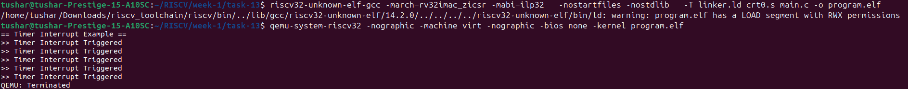

# Task-13: Interrupt Primer

## Objective
To enable the machine-timer interrupt (MTIP) and write a simple handler in C.


## What is the Machine Timer Interrupt (MTIP)?

The **Machine Timer Interrupt (MTIP)** is a fundamental interrupt in the RISC-V privileged architecture. It is triggered by the machine timer, which uses two special memory-mapped registers:

- **mtime**: A continuously incrementing 64-bit timer register representing the current time.
- **mtimecmp**: A 64-bit comparator register. When `mtime` equals or exceeds `mtimecmp`, the machine timer interrupt is triggered.

These registers are usually implemented in the **CLINT** (Core Local Interruptor) hardware block of the RISC-V system.


## How MTIP Works in this Example

- **Setting up MTIP**:  
  We program `mtimecmp` to `mtime + MTIMECMP_DELAY`. The timer interrupt fires when the current time reaches this threshold.

- **Interrupt generation**:  
  When `mtime` reaches `mtimecmp`, the hardware sets the MTIP bit in the `mip` register, causing the machine-level timer interrupt.

- **Interrupt handler**:  
  Control transfers to the `trap_handler`, which saves registers, calls the C-level `timer_isr()` function, then restores registers and returns using `mret`.

- **Reprogramming the timer**:  
  Inside `timer_isr()`, we print a message and update `mtimecmp` to trigger the next interrupt.

- **Interrupt count limit**:  
  The example limits the number of handled interrupts to 5, using a `count` variable.

---

## MTIP Handler in C

```c
#include <stdint.h>
#include <stddef.h>

#define UART_BASE        0x10000000
#define MSTATUS_MIE      (1 << 3)
#define MIE_MTIE         (1 << 7)
#define MTIMECMP_DELAY   500000

#define CLINT_MTIME      (*(volatile uint64_t *)(0x200bff8))
#define CLINT_MTIMECMP   (*(volatile uint64_t *)(0x2004000))

// UART output helper
void uart_puts(const char *s) {
    volatile char *uart = (volatile char *)UART_BASE;
    while (*s) {
        *uart = *s++;
    }
}

// Timer interrupt handler
volatile int count = 0;

void timer_isr(void) {
    if (count < 5) {
        uart_puts(">> Timer Interrupt Triggered\n");
        count++;
        CLINT_MTIMECMP = CLINT_MTIME + MTIMECMP_DELAY;
    }
}

void main(void) {
    uart_puts("== Timer Interrupt Example ==\n");

    timer_isr();  // Initial test call

    // Set mtvec to point to trap handler
    extern void trap_handler(void);
    uintptr_t trap_addr = (uintptr_t)&trap_handler;
    asm volatile("csrw mtvec, %0" :: "r"(trap_addr));

    // Set first timer interrupt
    CLINT_MTIMECMP = CLINT_MTIME + MTIMECMP_DELAY;

    // Enable machine timer interrupt and global interrupt
    asm volatile("csrs mie, %0" :: "r"(MIE_MTIE));
    asm volatile("csrs mstatus, %0" :: "r"(MSTATUS_MIE));

    while (1) {
        asm volatile("wfi");
    }
}
```
### Linker Script (intr_link.ld)
```ld
OUTPUT_ARCH(riscv)
ENTRY(_start)

MEMORY {
  RAM (rwx) : ORIGIN = 0x80000000, LENGTH = 16M
}

SECTIONS {
  . = 0x80000000;

  .text : {
    *(.text*)
  }

  .rodata : {
    *(.rodata*)
  }

  .data : {
    *(.data*)
  }

  .bss : {
    *(.bss*)
    *(COMMON)
  }

  .trap : {
    *(.trap)
  }

  . = ALIGN(4);
  PROVIDE(_stack_top = ORIGIN(RAM) + LENGTH(RAM));
}
```
### Startup Code (startup_intr.S)
```
.section .text
.globl _start
_start:
    la sp, _stack_top         // Initialize stack pointer
    call main                 // Call main()
1:  wfi                       // Halt if main returns
    j 1b

.section .trap, "ax"
.globl trap_handler
trap_handler:
    addi sp, sp, -16
    sw ra, 12(sp)
    sw t0, 8(sp)
    sw t1, 4(sp)
    sw t2, 0(sp)

    call timer_isr            // Call C handler

    lw ra, 12(sp)
    lw t0, 8(sp)
    lw t1, 4(sp)
    lw t2, 0(sp)
    addi sp, sp, 16
    mret
```

## OUTPUT
