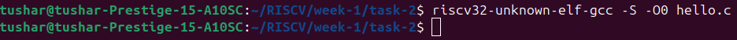
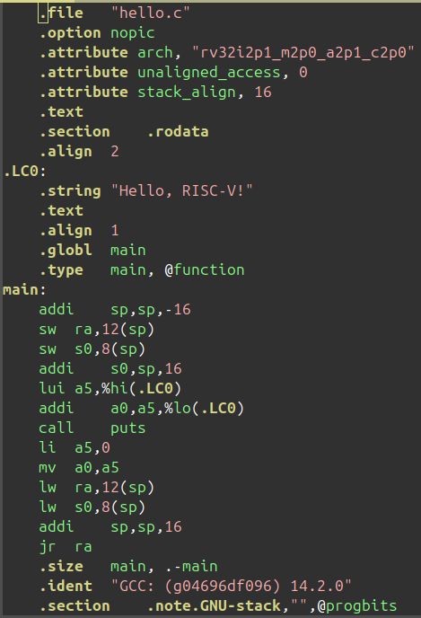

# Task-3: From C to Assembly

In this task, we will generate the assembly file for our simple C program and explain the meaning of **prologue** and **epilogue**.

---

## Step 1: Generate Assembly File

Use the following command to generate the assembly file:
```bash
riscv32-unknown-elf-gcc -S -O0 hello.c
```



**Flags used:**
- `-S`: Generate assembly instead of object code.
- `-O0`: Disable optimizations to see the raw function structure.

---

## Understanding **Prologue** and **Epilogue**



### Prologue

The **prologue** is the code at the start of a function. It:
- Allocates stack space
- Saves callee-saved registers (like `s0`, `ra`)
- Sets up the frame pointer (`s0`)

In our simple C program, the prologue is:
```assembly
addi	sp,sp,-16       # Allocate 16 bytes on the stack
sw	    ra,12(sp)       # Save return address
sw	    s0,8(sp)        # Save old frame pointer
addi	s0,sp,16        # Set new frame pointer (s0 = old sp)
```

### Epilogue

The **epilogue** is the code at the end of the function. It:
- Restores saved registers
- Deallocates stack
- Returns to the caller

In our program, the epilogue generated in the assembly file is:
```assembly
lw	    ra,12(sp)        # Restore return address
lw	    s0,8(sp)         # Restore old frame pointer
addi	sp,sp,16         # Deallocate stack frame
jr	    ra               # Jump to return address
```