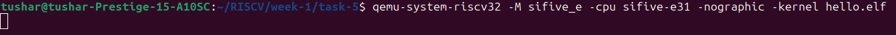

# Running Under an Emulator

This task demonstrates how to boot a bare-metal ELF and print to the UART console using QEMU.

---

## Minimal `hello.c` for Bare-Metal QEMU Run

```c
int main() {
    puts("Hello, RISCV!");
    return 0;
}
```

**Compile it using:**
```bash
riscv32-unknown-elf-gcc -g -march=rv32imac -mabi=ilp32 -o hello.elf hello.c
```

**Run the ELF using QEMU:**
```bash
qemu-system-riscv32 -M sifive_e -cpu sifive-e31 -nographic -kernel hello.elf
```



---

## Ideal Behaviour

Ideally, it should print `"Hello, RISCV!"` in the UART console, but it goes blank after starting QEMU.

---

## Steps Done for Troubleshooting

### Custom UART Print Implementation

Created a minimal UART print routine:

```c
#define UART_ADDR 0x10013000

void putchar(char c) {
    *(volatile char*)UART_ADDR = c;
}

void print(const char* s) {
    while (*s) {
        putchar(*s++);
    }
}

void _start() {
    print("hello riscv\n");
    while (1); // don't exit
}
```

---

### Custom Linker Script (`link.ld`)

```ld
SECTIONS
{
  . = 0x80000000;

  .text : {
    *(.text*)
  }

  .data : {
    *(.data*)
  }

  .bss : {
    *(.bss*)
    *(COMMON)
  }
}
```

---

### Compile with Custom Linker Script

```bash
riscv32-unknown-elf-gcc \
  -nostdlib -nostartfiles \
  -march=rv32ima -mabi=ilp32 \
  -Wl,-T,link.ld \
  -o hello.elf hello.c
```

---

### Run with QEMU

```bash
qemu-system-riscv32 \
  -machine sifive_e -nographic \
  -bios none \
  -kernel hello.elf
```